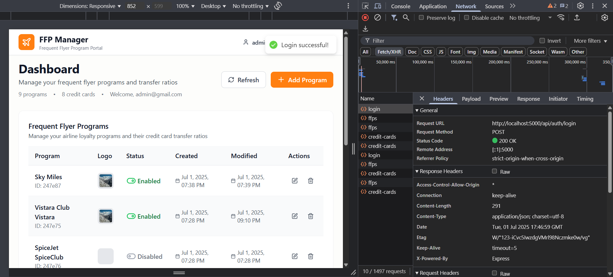
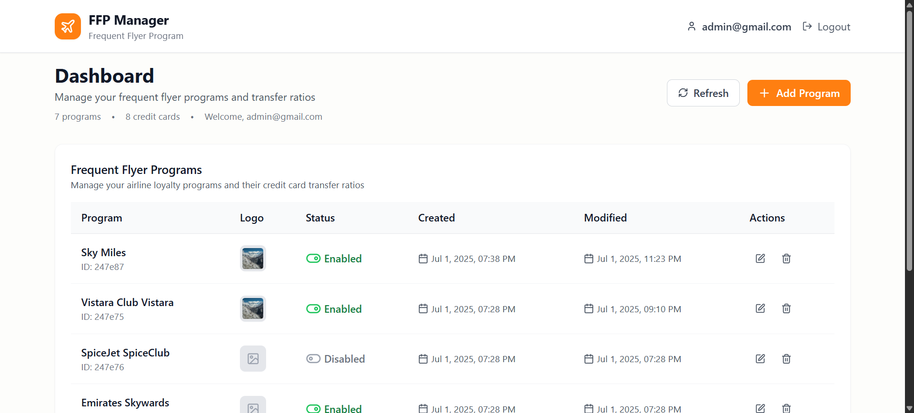
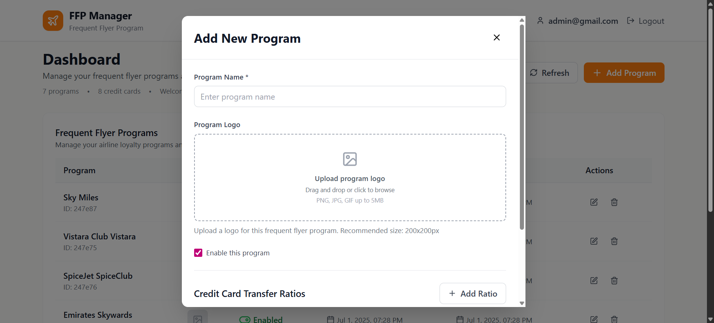
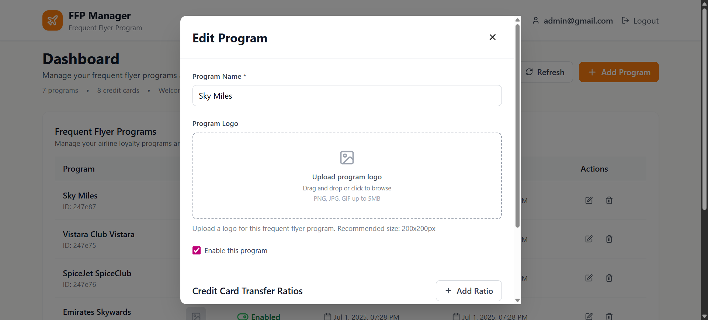
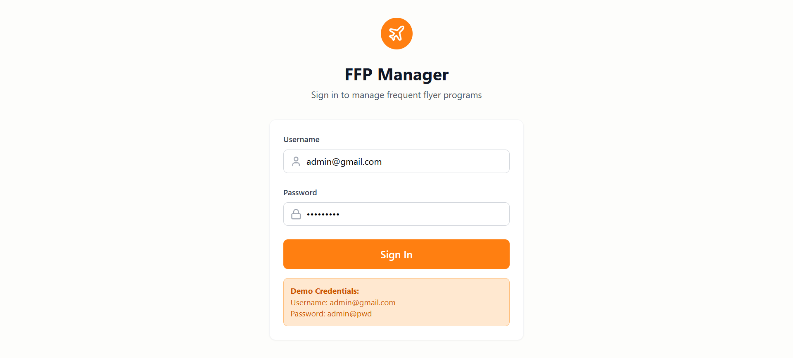
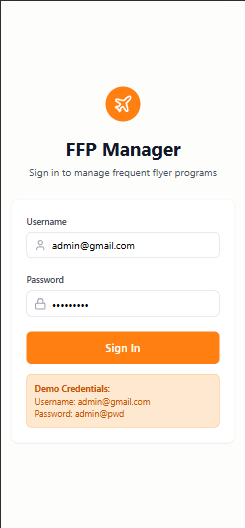
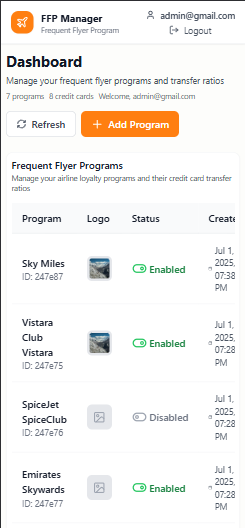
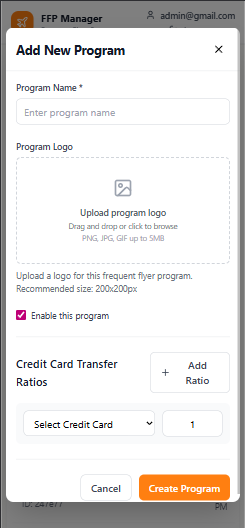

# Project Frequent-Flyer-Programs

A full-stack MERN (MongoDB, Express, React, Node.js) application for managing credit cards, frequent flyer programs, and transfer ratios.

## Features
- User authentication (JWT-based)
- Manage credit cards and frequent flyer programs
- Set and update transfer ratios between cards and programs
- Image upload support (Cloudinary)
- Protected routes and role-based access

## Screenshots

<table>
  <tr>
    <td></td>
    <td></td>
    <td></td>
    <td></td>
  </tr>
  <tr>
    <td></td>
    <td></td>
    <td></td>
    <td></td>
  </tr>
</table>

## Project Structure
```
project/
  backend/      # Express + MongoDB backend
  frontend/     # React + Vite frontend
```

## Prerequisites
- Node.js (v16+ recommended)
- npm or yarn
- MongoDB instance (local or cloud)
- Cloudinary account (for image uploads)

## Environment Variables

### Backend (`backend/.env`)
```
MONGODB_URI=your_mongodb_connection_string
JWT_SECRET=your_jwt_secret
CLOUDINARY_CLOUD_NAME=your_cloudinary_cloud_name
CLOUDINARY_API_KEY=your_cloudinary_api_key
CLOUDINARY_API_SECRET=your_cloudinary_api_secret
```

### Frontend (`frontend/.env`)
```
VITE_SERVER_BASE_URL=http://localhost:5000
```

## Setup Instructions

### 1. Clone the repository
```
git clone <repo-url>
cd project
```

### 2. Install dependencies
#### Backend
```
cd backend
npm install
```
#### Frontend
```
cd ../frontend
npm install
```

### 3. Set up environment variables
- Copy the example variables above into `.env` files in `backend/` and `frontend/`.

### 4. Run the app
#### Start Backend
```
cd backend
npm run dev
```
#### Start Frontend
```
cd ../frontend
npm run dev
```

The frontend will be available at [http://localhost:5173](http://localhost:5173) (default Vite port).

## Scripts
- `npm run dev` — Start development server
- `npm run build` — Build for production
- `npm start` — Start production server (backend)

## License
MIT 
